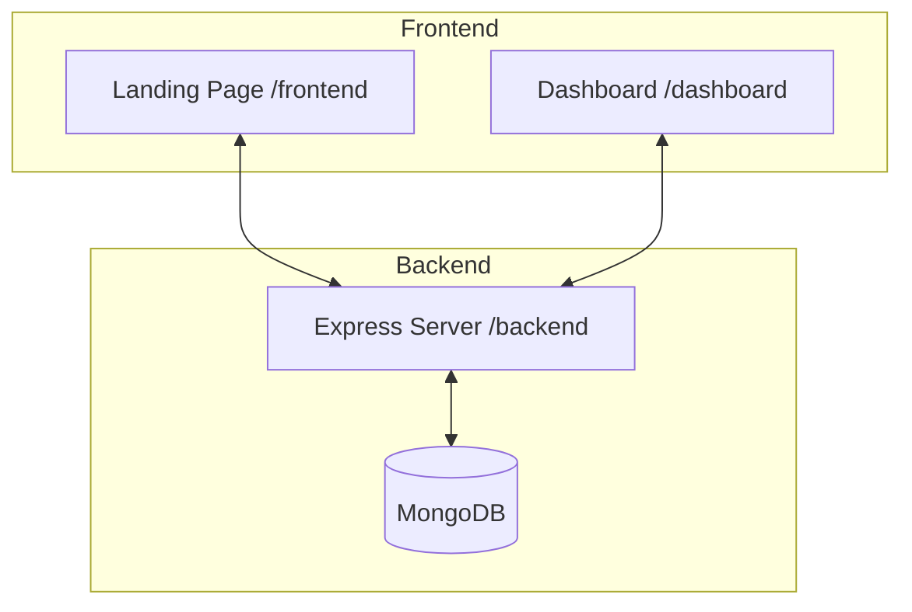

# Zerodha Clone - Full Stack Trading Platform


## 🚀 Overview
A comprehensive full-stack clone of the Zerodha trading platform. This project features a robust backend for managing trades, holdings, and positions, along with a sophisticated dashboard for real-time data visualization and a modern landing page.

## 🏗️ Architecture


## ✨ Key Features
- **Project Dashboard**: A detailed view of your portfolio, including holdings and positions.
- **Real-time Watchlist**: Monitor your favorite stocks with ease.
- **Order Management**: Buy and sell actions with instant confirmation.
- **Interactive Charts**: Visualize stock performance using Chart.js.
- **Secure Backend**: Express.js server with MongoDB for reliable data management.
- **Modern UI/UX**: Clean and professional interface built with React and Material UI.

## 🛠 Tech Stack
### Backend
- **Node.js & Express.js**: Server-side logic and RESTful APIs.
- **MongoDB & Mongoose**: Scalable NoSQL database and schema management.
- **Passport.js**: Robust authentication middleware.
- **CORS & Body-Parser**: Secure and efficient request handling.

### Frontend & Dashboard
- **React.js**: Modular UI components and dynamic state.
- **Material UI (MUI)**: Premium, responsive design tokens.
- **Chart.js**: High-performance data visualization.
- **Axios**: Smooth API integrations.
- **React Router**: Single-page application navigation.

## 📦 Project Structure
```text
ZERODHA-CLONE/
├── backend/    # REST API, DB Models, Controllers
├── dashboard/  # Portfolio Analysis & Trading Core
└── frontend/   # User Onboarding & Landing Experience
```

## ⚙️ Installation & Setup

### 1. Prerequisite
- Node.js installed
- MongoDB instance (local or Atlas)

### 2. Clone the Repository
```bash
git clone https://github.com/jayfinaviya/zerodha-clone.git
cd zerodha-clone
```

### 3. Backend Setup
```bash
cd backend
npm install
# Create a .env file with MONGO_URL and PORT
npm start
```

### 4. Dashboard Setup
```bash
cd dashboard
npm install
npm start
```

### 5. Frontend Setup
```bash
cd frontend
npm install
npm start
```

---
Developed with ❤️ by [Jay Finaviya](https://github.com/jayfinaviya)
